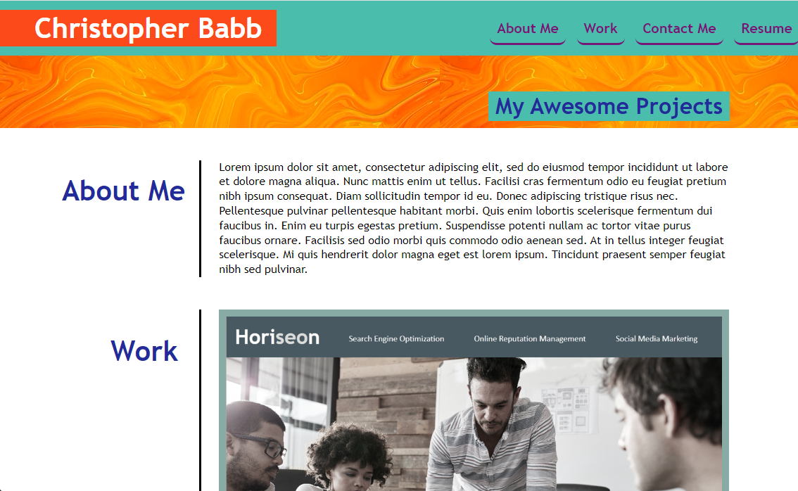

# Christopher Babb's Portfolio

Welcome to my portfolio! This repository showcases my projects and provides information about me.

## About Me

I am a passionate developer with experience in web development and game development. I love building web applications and games, mobile apps, and working on back-end development. I am constantly learning new technologies and trying to improve my skills.

## Portfolio website:

Link to my portfolio: https://babbalicious.github.io/portfolio/

## Projects

### Project 1: Horiseon Marketing webpage

- **Description**: Provided semantic HTML for the Horiseon Marketing webpage.
- **Technologies**: HTML, CSS
- **Demo**: https://babbalicious.github.io/horiseon-marketing/
- **Repository**: https://github.com/Babbalicious/horiseon-marketing

### Project 2: Health and Fitness Tracker

- **Description**: Health and Fitness Portfolio
- **Technologies**: API fetch
- **Demo**: https://pauldsherrill.github.io/fitness-tracker-project/
- **Repository**: https://github.com/pauldsherrill/fitness-tracker-project

### Project 3: Node.js Project

- **Description**: Node.js project
- **Technologies**: Node.js
- **Demo**: N/A
- **Repository**: N/A

## Contact Me

Feel free to reach out to me if you have any questions, suggestions, or collaboration opportunities.

- **Email**: ccbabb@gmail.com
- **GitHub**: https://github.com/Babbalicious

## License

This project is licensed under the [MIT License](https://opensource.org/licenses/MIT).
